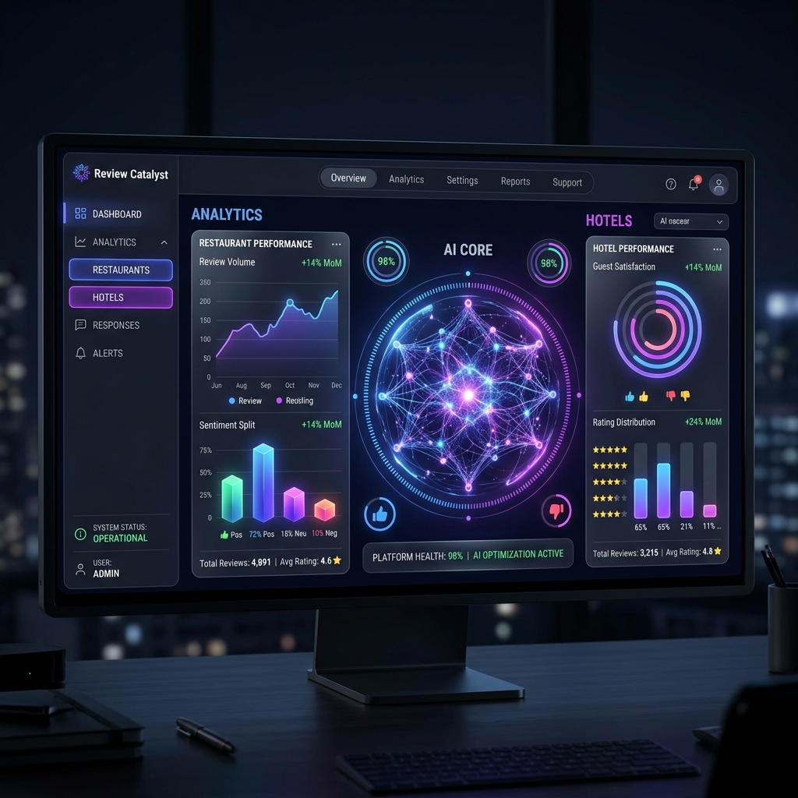

# Review Catalyst 🚀
### Neural-Powered Strategic Review Automation

**Review Catalyst** is a high-fidelity, enterprise-grade platform designed to automate and analyze customer feedback across multiple industries using the **Google Gemini 1.5 Flash** AI. 

Built with a cinematic "Neural Nexus" aesthetic, it transforms raw reviews into actionable strategic intelligence through real-time synchronization and deep sentiment analysis.



---

## ✨ Key Features

- **Neural Sync Engine**: Real-time WebSocket architecture that pushes reviews to the dashboard with zero latency.
- **AI Strategic Intelligence**: Automated "Themes Display" and "Neural Health Score" powered by Gemini 1.5.
- **Dynamic 3D Core**: A reactive Three.js pulsar that changes speed and color based on your business's performance health.
- **Multilingual Support**: Automatically detects and responds in the customer's native language.
- **Smart Rule Engine**: Customizable automation triggers based on rating, sentiment, and keyword matching.
- **Enterprise Settings**: Manage multiple locations (Restaurants, Hotels, Clinics, etc.) from a single unified hub.

---

## 🛠️ Tech Stack

- **Frontend**: React, Vite, Framer Motion, Recharts
- **3D Graphics**: Three.js, React Three Fiber, Drei
- **Backend**: FastAPI (Python), Uvicorn
- **AI Logic**: Google Gemini API (google-genai)
- **Real-time**: WebSockets (FastAPI Manager)
- **Styling**: Vanilla CSS (Glassmorphism & Radial Glows)

---

## 🚀 Getting Started

### Prerequisites
- Node.js (v18+)
- Python (v3.9+)
- Google Gemini API Key

### Backend Setup
1. Navigate to `backend/`
2. Install dependencies:
   ```bash
   pip install -r requirements.txt
   ```
3. Start the engine:
   ```bash
   python main.py
   ```

### Frontend Setup
1. Navigate to `frontend/`
2. Install dependencies:
   ```bash
   npm install
   ```
3. Launch the dashboard:
   ```bash
   npm run dev
   ```

---

## 📂 Project Structure

- `frontend/`: React components, 3D visualizers, and glassmorphic UI.
- `backend/`: FastAPI endpoints, AI service logic, and WebSocket manager.
- `storage.json`: Local persistence for rules, profiles, and reviews.

---

## 📄 License
This project is licensed under the MIT License - see the LICENSE file for details.

*Developed with ❤️ as part of the AI-Powered Review Response Automation suite.*
